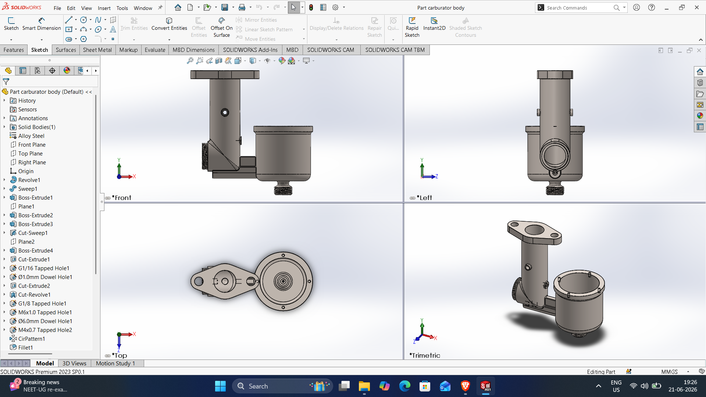
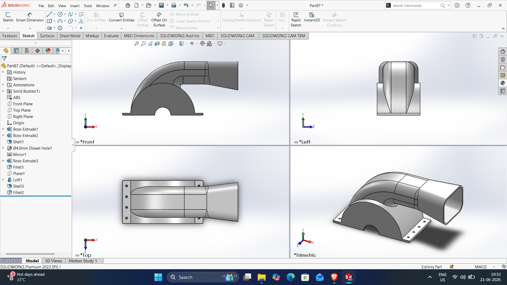
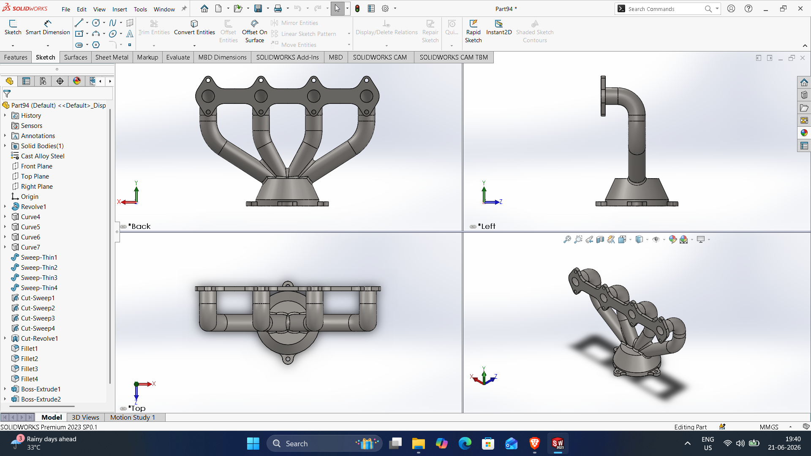

# SOLIDWORKS-CSWP-3D-FILES
# Part carburator body

DWG file: Part-carburator-body.SLDPRT

# Blower-body

DWG file: Blower-body.SLDPRT

# Exaust-valve

DWG file: Exaust-valve.SLDPRT

# Part4

DWG file: Part4.SLDPRT

# Part4

DWG file: Part4.SLDPRT

# Part4

DWG file: Part4.SLDPRT

# Part4

DWG file: Part4.SLDPRT

# Part4

DWG file: Part4.SLDPRT

# Part4

DWG file: Part4.SLDPRT

# Part4

DWG file: Part4.SLDPRT

# Part4

DWG file: Part4.SLDPRT

# Part4

DWG file: Part4.SLDPRT

# Part4

DWG file: Part4.SLDPRT

# Part4

DWG file: Part4.SLDPRT

# Part4

DWG file: Part4.SLDPRT

# Part4

DWG file: Part4.SLDPRT

# Part4

DWG file: Part4.SLDPRT
