# SOLIDWORKS-CSWP-3D-FILES
# Part carburator body

DWG file: Part-carburator-body.SLDPRT

# Blower-body

DWG file: Blower-body.SLDPRT

# Exaust-valve

DWG file: Exaust-valve.SLDPRT

# Heat-exchanger

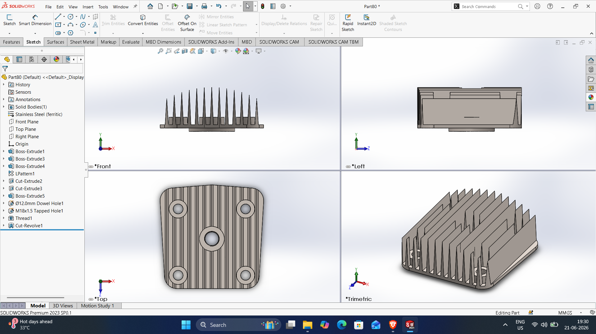

DWG file: Heat-exchanger.SLDPRT

# Screw-driver

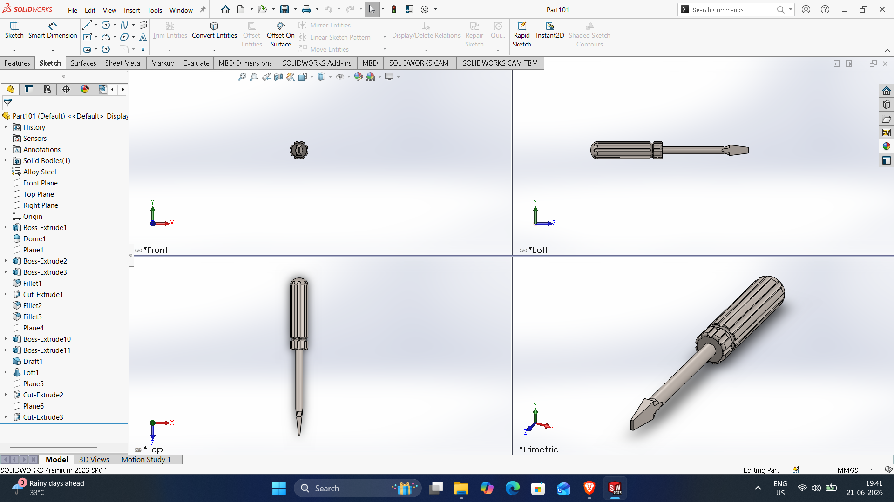

DWG file: Screw-driver.SLDPRT

# Spring

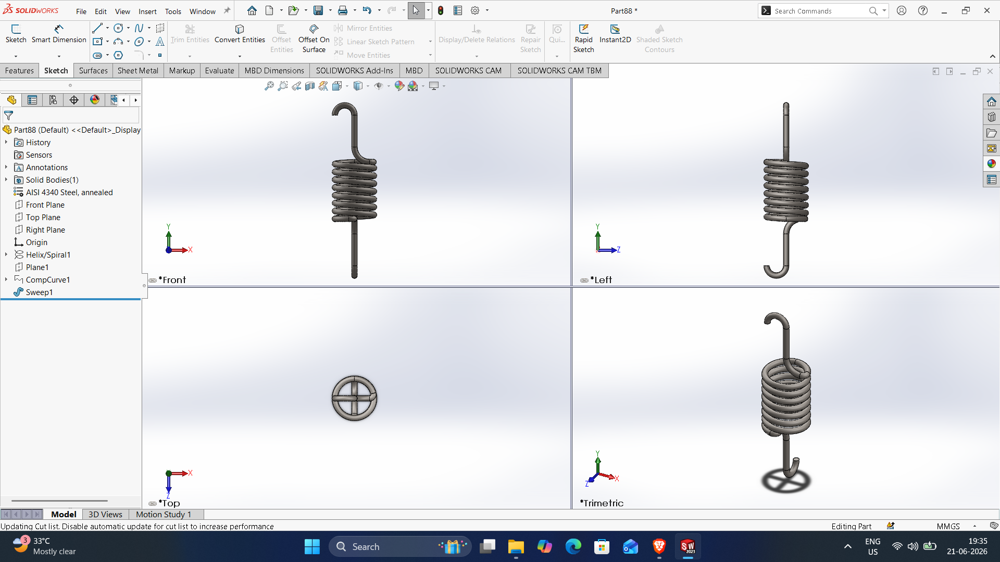

DWG file: Spring.SLDPRT

# Part44good

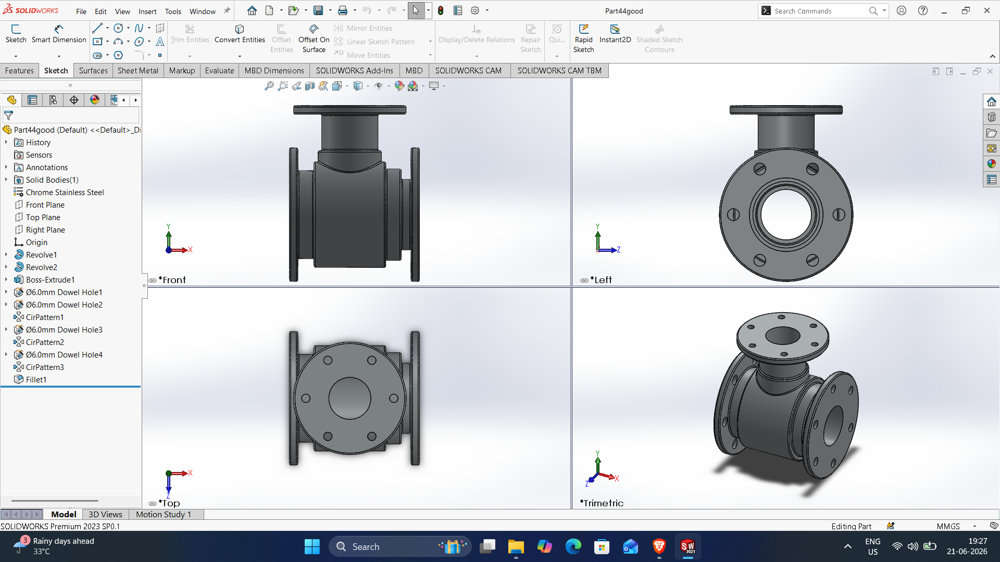

DWG file: Part44good.SLDPRT

# Part46

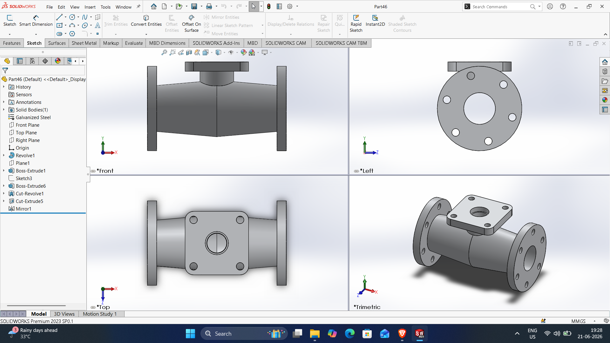

DWG file: Part46.SLDPRT

# Part57

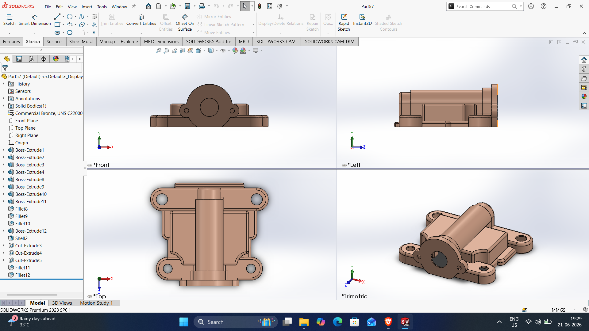

DWG file: Part57.SLDPRT

# Part58

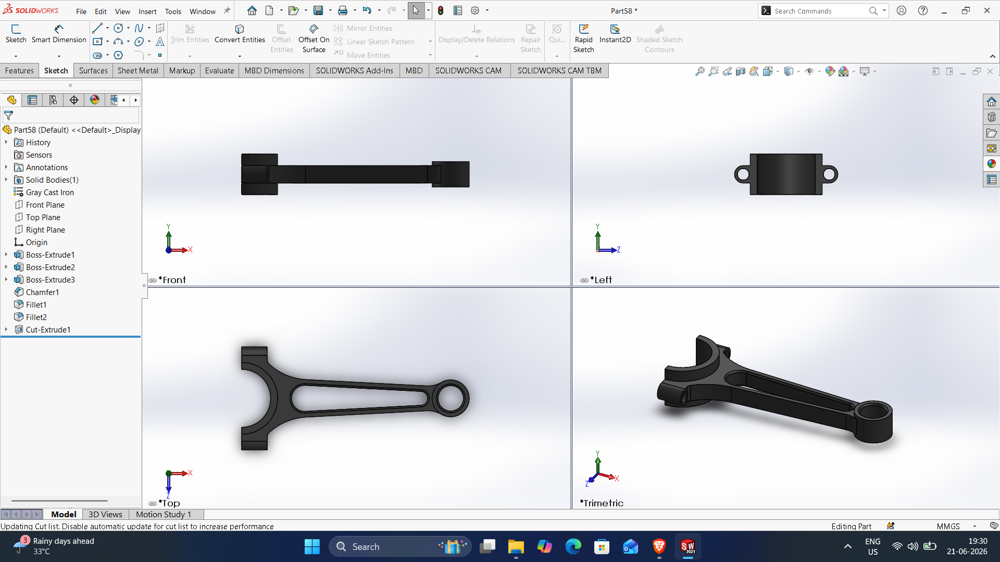

DWG file: Part58.SLDPRT

# Part86

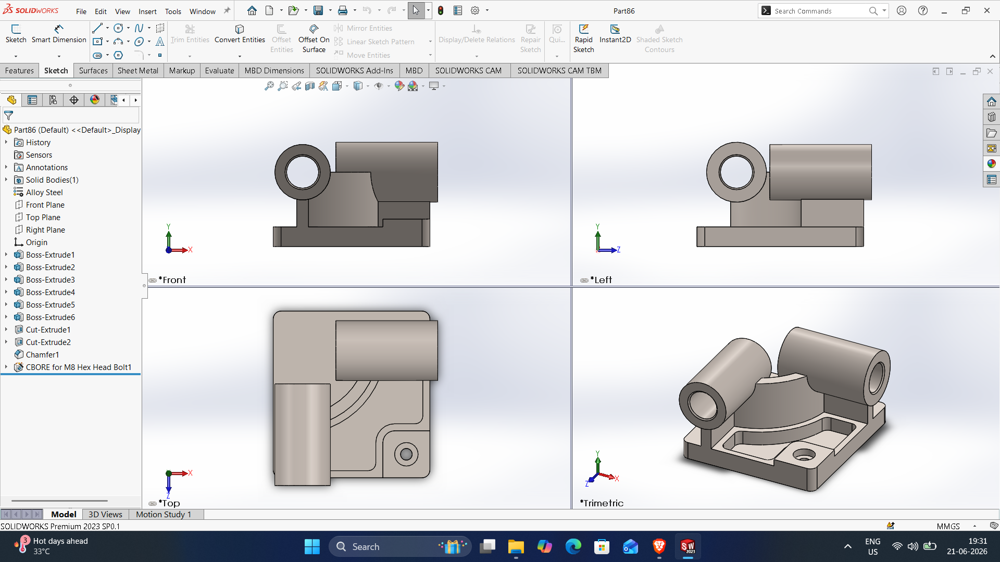

DWG file: Part86.SLDPRT

# Part90

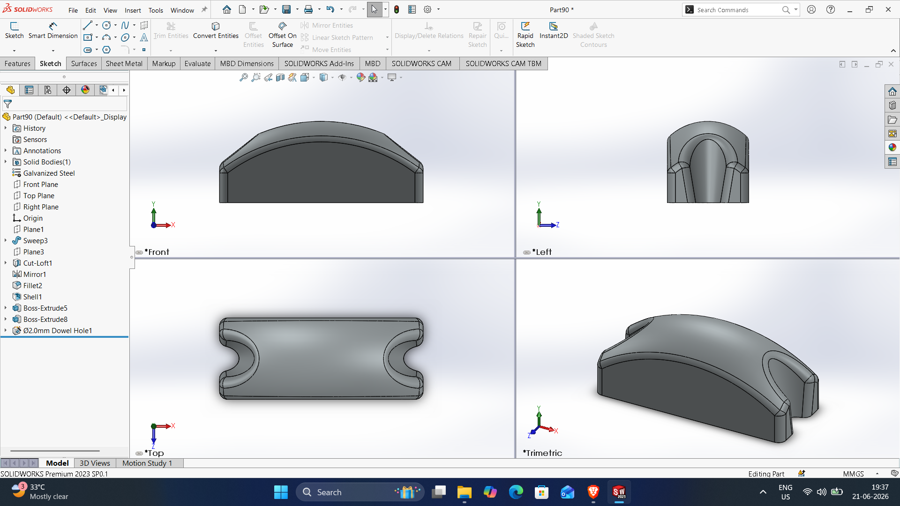

DWG file: Part90.SLDPRT

# Part103

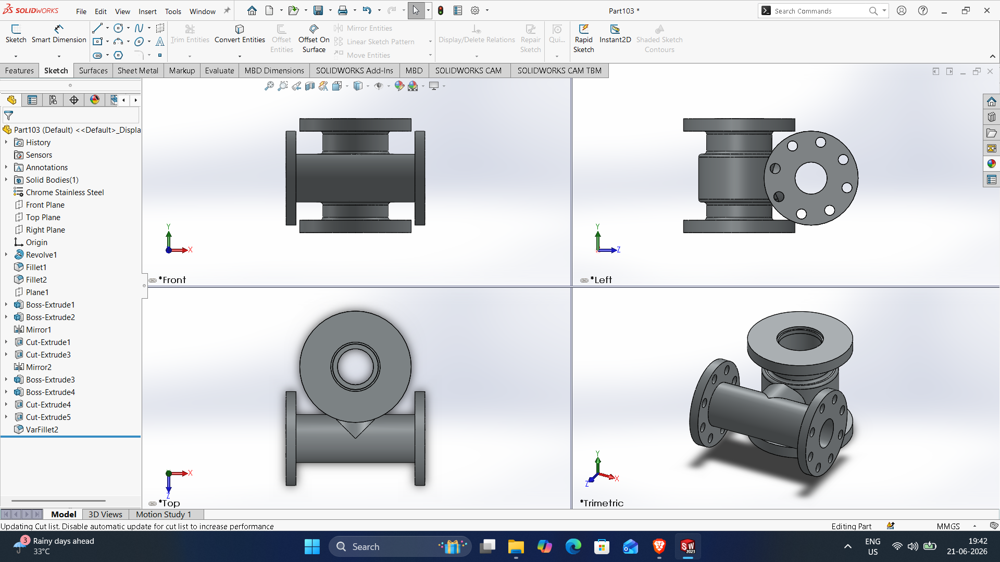

DWG file: Part103.SLDPRT

# Part104

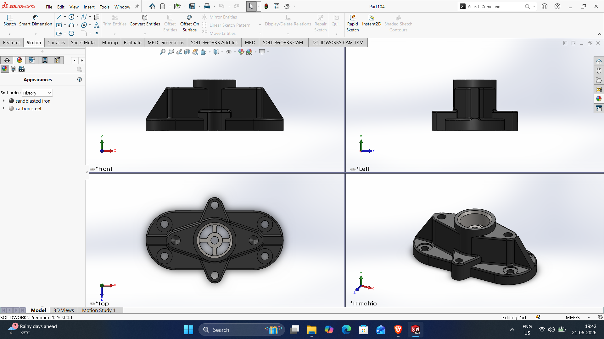

DWG file: Part104.SLDPRT

# Part105

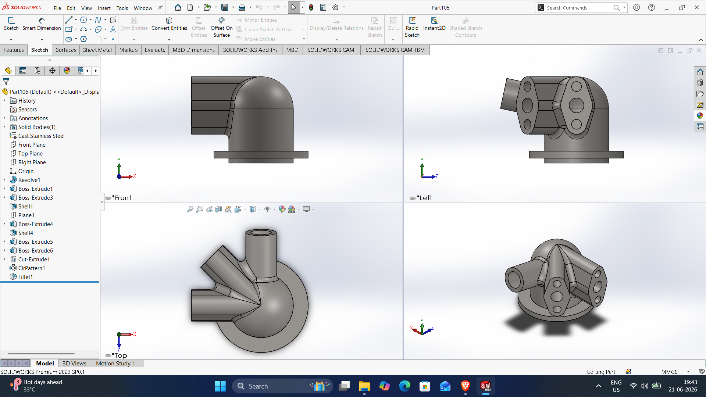

DWG file: Part105.SLDPRT

# Part106

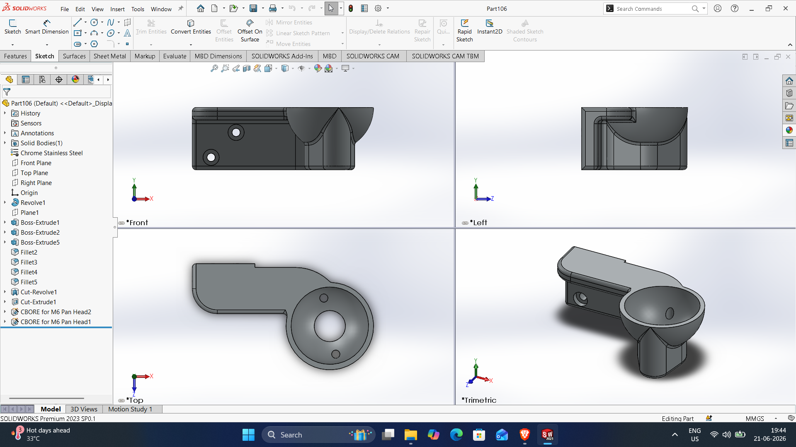

DWG file: Part106.SLDPRT

# Part107

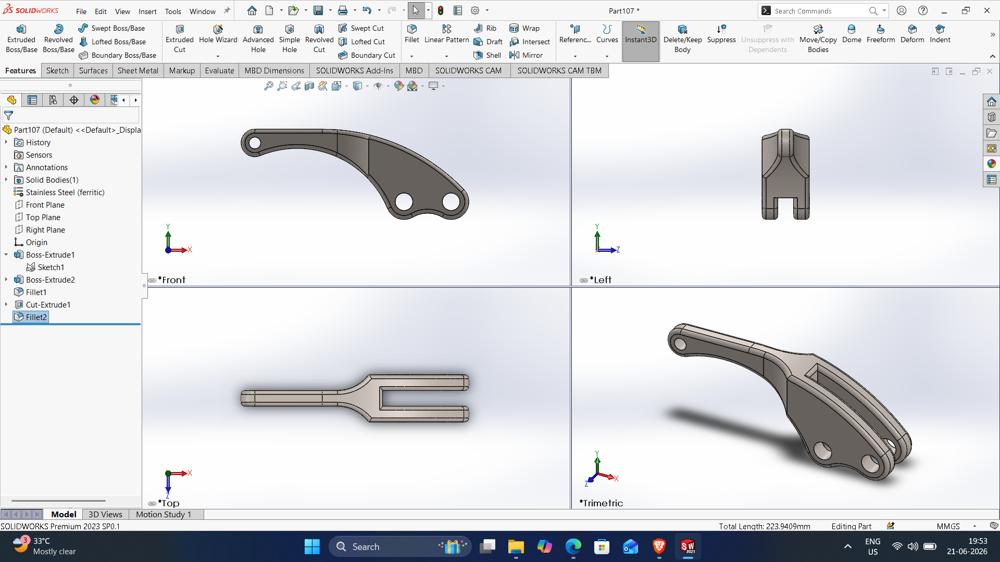

DWG file: Part107.SLDPRT
